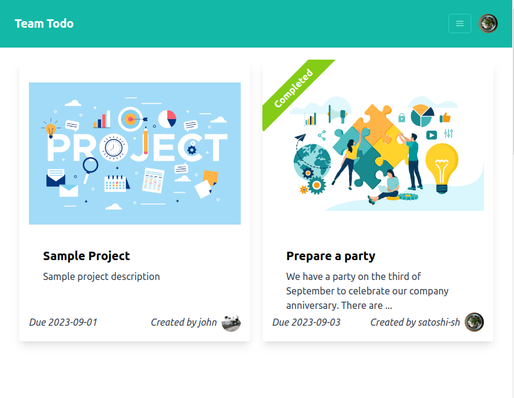
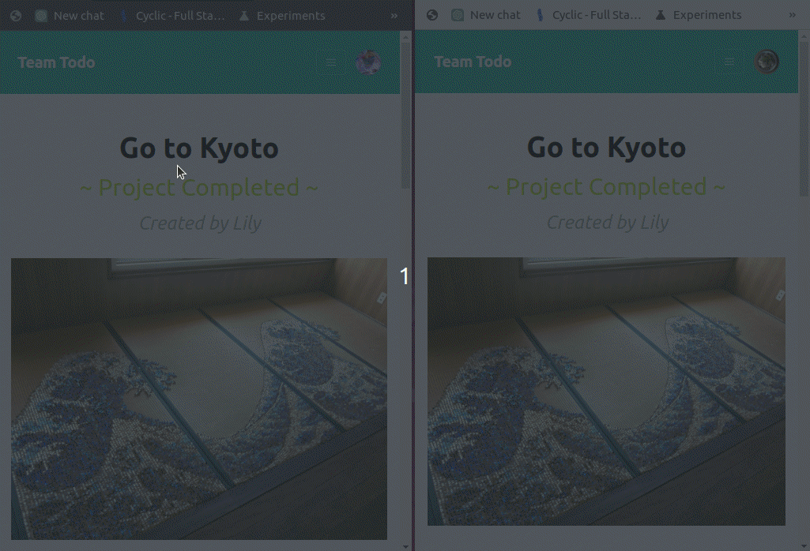

# Team Todo

## Description

This application allows users to create projects and other members take todo tasks. It features real-time updates using websockets to show the status of projects as well as a chat function for communication among team members. This enables seamless collaboration, task assignment, progress tracking, and communication within the application.

This project was created for [ComIT](https://www.comit.org/) Node.js course as my final project.

## How to run locally

### Setup

- Install Node
- Create .env file according the sample.env file in the server folder.
- Install mongodb and run it.
- Run command `node populate.js` at the server folder terminal.

### Run app

- Run `npm start` at client folder
- Run `npm start` at server folder
- The page is avaialble on http://localhost:4000/team-todo

## Technologies Used

- React
- Express
- MongoDB
- WebSocket
- Tailwind CSS

## Outlook

